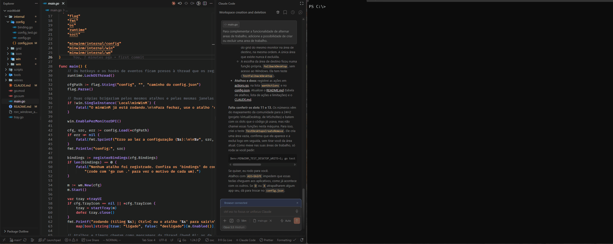

# minWinM

**Tiling automático de janelas para Windows, controlado pelo teclado no estilo Vim.**

O minWinM organiza todas as janelas abertas num grid, um por monitor, e mantém
esse grid arrumado sozinho: abriu, fechou ou minimizou uma janela, o resto se
reorganiza. Você navega e reorganiza com `h` `j` `k` `l`, redimensiona sem
deixar uma janela cobrir a outra e pode tirar qualquer janela do grid por um
momento (para o centro, por exemplo) e devolvê-la depois ao mesmo lugar.

Também cuida das **áreas de trabalho virtuais**: cada área tem seu próprio grid,
e com um atalho você pula direto para qualquer área (da 1 para a 3, sem passar
pela 2), vai para a próxima ou a anterior, manda a janela focada para outra
área, ou cria e exclui áreas.

É um único executável em Go, sem serviço e sem dependências, que roda em
segundo plano com um ícone na área de notificação. Um script instala e faz ele
iniciar com o Windows. Toda a configuração fica num `config.json`.



---

## Sumário

- [Começando](#começando)
- [Como o grid funciona](#como-o-grid-funciona)
- [Atalhos padrão](#atalhos-padrão)
- [Usando o mouse](#usando-o-mouse)
- [Modos especiais](#modos-especiais)
- [Configuração](#configuração)
- [Quais janelas entram no grid](#quais-janelas-entram-no-grid)
- [Log para diagnóstico](#log-para-diagnóstico)
- [Limitações conhecidas](#limitações-conhecidas)
- [Desenvolvimento](#desenvolvimento)

---

## Começando

Requisitos: Windows 10 ou 11 e [Go](https://go.dev/dl/) 1.22+ (só para
compilar).

### Instalar (roda em segundo plano e inicia com o Windows)

Na pasta do projeto:

```powershell
powershell -ExecutionPolicy Bypass -File scripts\install.ps1
```

O script:

1. compila o `minWinM.exe` sem janela de console;
2. instala em `%LOCALAPPDATA%\Programs\minWinM`;
3. cria ali um `config.json` editável (se ainda não existir; o seu nunca é
   sobrescrito);
4. cria um atalho no menu Iniciar e outro em *Inicializar*, para abrir junto
   com o Windows;
5. inicia o minWinM.

Rodar o script de novo **atualiza** a instalação: fecha a versão em execução,
recompila e abre de novo. Para instalar sem iniciar com o Windows, acrescente
`-NoStartup`.

- **Está rodando?** Procure o ícone do minWinM na área de notificação (perto
  do relógio; pode estar no `^` dos ícones ocultos): um mini-grid **azul** com
  o tiling ligado, **cinza** com ele desligado. Clique nele para ligar/desligar
  o tiling, reorganizar ou sair. Para deixá-lo sempre visível, arraste-o do
  `^` para a barra.
- **Fechar:** `Ctrl+Alt+Q` ou *Sair* no menu do ícone.
- **Abrir de novo:** menu Iniciar → *minWinM*.
- **Mudar atalhos:** edite `%LOCALAPPDATA%\Programs\minWinM\config.json` e
  reabra o minWinM (`Ctrl+Alt+Q` e abrir pelo menu Iniciar).
- **Receber atalhos novos depois de atualizar:** o script nunca sobrescreve o
  seu `config.json`. Para trocá-lo pelo padrão atual, rode com `-ResetConfig`
  (o antigo fica em `config.json.bak`).
- **Desinstalar:** `powershell -ExecutionPolicy Bypass -File scripts\uninstall.ps1`
  (com `-KeepConfig` para guardar o `config.json`).

Só uma cópia roda por vez: abrir o minWinM com ele já aberto mostra um aviso.
Erros de inicialização (como um `config.json` inválido) também aparecem numa
caixa de mensagem, já que não há console.

### Rodar sem instalar (para testar ou desenvolver)

```sh
go run .
```

Rodando assim, uma janela de console mostra cada atalho como `ok`, `falhou`
(por exemplo, por já estar em uso por outro programa) ou `ignorado` (erro no
`config.json`):

```
config: (padrão embutido)
  ok        alt+h                    -> focus-left
  ok        alt+j                    -> focus-down
  ...
rodando (tiling ligado); Ctrl+C ou o atalho 'quit' para sair
```

Para gerar só o executável sem console, sem instalar:

```sh
go build -ldflags="-H=windowsgui -s -w" -o minWinM.exe .
```

---

## Como o grid funciona

Cada monitor tem seu próprio grid. Com **n** janelas, o grid tem **⌈√n⌉
colunas**; quando a divisão não é exata, as colunas da direita recebem as
janelas que sobram:

```
 1 janela        2 janelas       3 janelas       4 janelas       5 janelas
┌───────────┐   ┌─────┬─────┐   ┌─────┬─────┐   ┌─────┬─────┐   ┌───┬───┬───┐
│           │   │     │     │   │     │  2  │   │  1  │  3  │   │   │ 2 │ 4 │
│     1     │   │  1  │  2  │   │  1  ├─────┤   ├─────┼─────┤   │ 1 ├───┼───┤
│           │   │     │     │   │     │  3  │   │  2  │  4  │   │   │ 3 │ 5 │
└───────────┘   └─────┴─────┘   └─────┴─────┘   └─────┴─────┘   └───┴───┴───┘
```

As janelas ocupam o grid coluna a coluna, de cima para baixo.

- **Janela nova** entra no fim do grid.
- **Fechar ou minimizar** reorganiza as demais. Uma janela minimizada **guarda
  o lugar**: ao ser restaurada, volta para a mesma posição.
- **Cada área de trabalho virtual tem seu próprio grid** (por monitor), com
  suas próprias proporções. Trocar de área não bagunça a outra, e uma janela
  movida para outra área (pelos atalhos ou pela Visão de Tarefas) entra no fim
  do grid de lá.
- **Ao iniciar**, as janelas entram no grid na ordem em que já estavam na tela
  (da esquerda para a direita), para mudar o mínimo possível.
- **Proporções:** larguras de coluna e alturas de linha podem ser ajustadas e
  sempre somam a tela inteira, então o grid nunca fica com buracos nem
  sobreposições. Nenhuma coluna ou linha fica com menos de 10% da tela.
- **Abrir ou fechar janelas mantém os ajustes:** quando o grid muda de formato,
  cada janela parte do tamanho que tinha (uma coluna fica com a largura das
  janelas que vão para ela, e cada janela com a sua altura relativa) e o grid
  se reajusta para fechar a tela. Uma janela nova recebe a média das vizinhas.
  `Ctrl+Alt+B` (`balance`) volta tudo para tamanhos iguais.

---

## Atalhos padrão

As direções seguem o Vim: **h** = esquerda, **j** = baixo, **k** = cima,
**l** = direita.

### Navegar e mover

| Atalho | Ação | O que faz |
|---|---|---|
| `Alt` + `h` `j` `k` `l` | `focus-*` | Foca a janela vizinha naquela direção (atravessa monitores) |
| `Alt` + `Shift` + `h` `j` `k` `l` | `move-*` | Troca a janela focada de lugar com a vizinha. Na borda da tela, leva a janela para o monitor ao lado |
| `Ctrl` + `Alt` + `Shift` + `→` / `←` | `next-monitor` / `prev-monitor` | Manda a janela para o grid do próximo / anterior monitor |

### Áreas de trabalho virtuais

| Atalho | Ação | O que faz |
|---|---|---|
| `Alt` + `1` … `9` | `desktop-1` … `desktop-9` | Vai direto para a área N (da 1 para a 3 sem passar pela 2) |
| `Alt` + `n` / `p` | `desktop-next` / `desktop-prev` | Vai para a próxima / anterior (da última volta para a primeira) |
| `Alt` + `Shift` + `1` … `9` | `move-to-desktop-1` … `move-to-desktop-9` | Manda a janela focada para a área N; você continua onde está |
| `Alt` + `Shift` + `n` / `p` | `move-to-desktop-next` / `move-to-desktop-prev` | Manda a janela focada para a próxima / anterior |
| `Alt` + `Shift` + `d` | `desktop-create` | Cria uma área nova (no fim da lista) e vai para ela |
| `Alt` + `Shift` + `x` | `desktop-delete` | Exclui a área atual e vai para a anterior (ou a seguinte, se era a primeira); as janelas dela vão junto, para o fim do grid de lá. A única área não é excluída |

A numeração segue a ordem da Visão de Tarefas (`Win+Tab`). Áreas que não
existem são ignoradas; crie mais com `Alt+Shift+D` (ou `Win+Ctrl+D`). Depois
de trocar, criar ou excluir uma área, ou de mandar uma janela embora, o foco
vai para a janela mais ao topo da área atual.
Os atalhos do próprio Windows (`Win+Ctrl+←/→`, `Win+Ctrl+D`, `Win+Ctrl+F4`)
continuam funcionando.

### Redimensionar e espaçamento

| Atalho | Ação | O que faz |
|---|---|---|
| `Ctrl` + `Alt` + `l` / `h` | `grow-width` / `shrink-width` | Aumenta / diminui a largura da coluna |
| `Ctrl` + `Alt` + `k` / `j` | `grow-height` / `shrink-height` | Aumenta / diminui a altura da janela na coluna |
| `Ctrl` + `Alt` + `b` | `balance` | Volta todas as proporções do monitor para iguais |
| `Alt` + `Shift` + `=` / `-` | `gap-increase` / `gap-decrease` | Aumenta / diminui o espaço entre janelas (2 px por vez) |

Os atalhos de redimensionar e de espaçamento repetem enquanto a tecla estiver
segurada.

### Janela focada

| Atalho | Ação | O que faz |
|---|---|---|
| `Alt` + `Shift` + `c` | `toggle-center` | Centraliza a janela; de novo, devolve ao lugar no grid ([detalhes](#janela-no-centro)) |
| `Alt` + `Shift` + `f` | `toggle-full-height` | A janela ocupa a coluna inteira; de novo, volta a dividir ([detalhes](#altura-total)) |
| `Alt` + `Shift` + `g` | `toggle-solo-column` | A janela fica sozinha na coluna e as outras dela vão para a coluna vizinha; de novo, desfaz ([detalhes](#coluna-só-dela)) |
| `Alt` + `Shift` + `m` | `minimize` | Minimiza (o lugar no grid fica guardado) |

### Grid

| Atalho | Ação | O que faz |
|---|---|---|
| `Alt` + `Shift` + `t` | `toggle-tiling` | Liga / desliga o grid automático |
| `Alt` + `Shift` + `r` | `retile` | Reorganiza tudo agora (útil se algum app se reposicionou sozinho) |
| `Ctrl` + `Alt` + `q` | `quit` | Fecha o minWinM |

### Posições fixas (presets)

Colocam a janela focada numa posição fixa da tela. Com o grid ligado, a janela
sai do grid ("flutua") e o lugar dela fica reservado. **Repetir o mesmo atalho
devolve a janela ao grid.** Com o grid desligado, repetir devolve a janela
para onde ela estava antes.

| Atalho | Preset | | Atalho | Preset |
|---|---|---|---|---|
| `Ctrl` + `Alt` + `←` | `left` (metade esquerda) | | `Ctrl` + `Alt` + `d` | `left-third` |
| `Ctrl` + `Alt` + `→` | `right` (metade direita) | | `Ctrl` + `Alt` + `f` | `center-third` |
| `Ctrl` + `Alt` + `↑` | `top` (metade de cima) | | `Ctrl` + `Alt` + `g` | `right-third` |
| `Ctrl` + `Alt` + `↓` | `bottom` (metade de baixo) | | `Ctrl` + `Alt` + `e` | `left-two-thirds` |
| `Ctrl` + `Alt` + `Shift` + `u` | `top-left` | | `Ctrl` + `Alt` + `t` | `right-two-thirds` |
| `Ctrl` + `Alt` + `Shift` + `i` | `top-right` | | `Ctrl` + `Alt` + `Enter` | `maximize` |
| `Ctrl` + `Alt` + `Shift` + `j` | `bottom-left` | | `Ctrl` + `Alt` + `c` | `center` |
| `Ctrl` + `Alt` + `Shift` + `k` | `bottom-right` | | | |

Todos os atalhos podem ser trocados no [`config.json`](#configuração).

---

## Usando o mouse

- **Arrastar e soltar sobre outra janela** troca as duas de lugar.
- **Arrastar para outro monitor** leva a janela para o grid daquele monitor.
- **Esticar ou encolher pela borda** move a divisa do grid: as vizinhas se
  ajustam em tempo real enquanto você arrasta, e ao soltar o novo tamanho fica
  valendo. Só a divisa arrastada se move; as outras colunas e linhas não
  mudam.
- Soltar em qualquer outro lugar faz a janela voltar ao seu espaço.

---

## Modos especiais

### Janela no centro

`Alt+Shift+C` (ou `Ctrl+Alt+C`) leva a janela focada para o centro da tela,
com 70% × 80% do tamanho. O lugar dela no grid fica reservado, e as outras
janelas não se mexem.

Com uma janela no centro, **`Alt+h/j/k/l` percorre as janelas pelo centro**:
a atual volta ao seu lugar e a vizinha naquela direção é centralizada. A
direção é contada a partir do lugar da janela no grid, não do centro da tela.

`Alt+Shift+C` de novo devolve a janela ao grid (isso vale para uma janela em
qualquer preset).

### Altura total

Numa coluna com janelas empilhadas, `Alt+Shift+F` faz a janela focada ocupar a
**coluna inteira**. As outras continuam no lugar delas, só que atrás. Enquanto
o modo estiver ativo, focar outra janela da coluna (`Alt+J`/`Alt+K` ou
clicando) passa a altura total para ela: a coluna funciona como uma pilha.

`Alt+Shift+F` de novo volta a dividir a coluna, com as proporções de antes.

### Coluna só dela

`Alt+Shift+G` também faz a janela focada ocupar a coluna inteira, mas sem
deixar ninguém atrás: as outras janelas da coluna vão para a coluna vizinha (a
da direita; se a janela já está na última coluna, a da esquerda) e se empilham
com as que já estavam lá. A largura das colunas é mantida.

```
+-----+-----+          +-----+-----+
|  A* |  C  |          |     |  B  |
+-----+-----+   -->    |  A* +-----+
|  B  |  D  |          |     |  C  |
+-----+-----+          |     +-----+
                       |     |  D  |
                       +-----+-----+
```

`Alt+Shift+G` de novo na mesma janela volta ao arranjo de antes (ordem e
proporções). Abrir, fechar ou minimizar uma janela naquele monitor também
volta ao grid automático.

### Grid desligado

Com `Alt+Shift+T`, o minWinM deixa as janelas onde estão. Foco
(`Alt+h/j/k/l`), presets e centralizar continuam funcionando, e
`Alt+Shift+h/j/k/l` troca duas janelas de posição. Ao religar, o grid é
remontado a partir do arranjo atual da tela.

---

## Configuração

Sem nenhum arquivo, vale a configuração embutida no executável (a mesma do
[`internal/config/config.json`](internal/config/config.json) deste repositório). Para personalizar, coloque um
`config.json` **ao lado do `minWinM.exe`** ou indique um arquivo:

```sh
minWinM.exe -config C:\caminho\meu.json
```

Exemplo:

```jsonc
{
  "gap": 6,              // px entre janelas vizinhas (padrão 0: encostadas)
  "outer_gap": 0,        // px nas bordas da tela (se omitido, igual a gap)
  "tiling": true,        // começa com o grid ligado
  "resize_step": 0.05,   // quanto cada grow/shrink muda (fração da tela)
  "ignore": ["Taskmgr.exe", "Spotify.exe"],
  "bindings": {
    "alt+h": "focus-left",
    "win+shift+enter": "toggle-center"
  }
}
```

> O `config.json` é JSON puro: os comentários acima são só explicação e não
> podem ir no arquivo real.

> `bindings` **substitui** a lista inteira de atalhos padrão. Copie o
> [`internal/config/config.json`](internal/config/config.json) do repositório e
> edite a partir dele.

### Opções

| Chave | Padrão | Descrição |
|---|---|---|
| `gap` | `0` | Pixels entre janelas vizinhas. Ajustável em tempo de execução com `Alt+Shift+=`/`-` |
| `outer_gap` | = `gap` | Pixels entre as janelas e as bordas da tela. Se omitido, acompanha o `gap`, inclusive quando ele muda pelos atalhos |
| `tiling` | `true` | Se o grid automático começa ligado |
| `resize_step` | `0.05` | Fração da tela que cada grow/shrink adiciona ou remove |
| `ignore` | `["Taskmgr.exe"]` | Executáveis ou classes de janela que nunca entram no grid (sem diferenciar maiúsculas) |
| `tray_icon` | `true` | Mostra o ícone na área de notificação |
| `log_verbose` | `false` | Liga o log detalhado desde o início ([detalhes](#log-para-diagnóstico)) |
| `bindings` | ver acima | Mapa `"atalho": "ação"` |

### Escrevendo atalhos

Formato: `modificador+modificador+tecla`, sem diferenciar maiúsculas. É
obrigatório pelo menos um modificador.

- **Modificadores:** `ctrl`, `alt`, `shift`, `win`
- **Teclas:** `a`–`z`, `0`–`9`, `f1`–`f12`, `left` `right` `up` `down`,
  `enter`, `space`, `tab`, `esc`, `home`, `end`, `pageup`, `pagedown`, `=`, `-`

### Todas as ações

| Grupo | Ações |
|---|---|
| Foco e movimento | `focus-left` `focus-down` `focus-up` `focus-right` · `move-left` `move-down` `move-up` `move-right` · `next-monitor` `prev-monitor` |
| Áreas de trabalho | `desktop-1` … `desktop-9` `desktop-next` `desktop-prev` · `move-to-desktop-1` … `move-to-desktop-9` `move-to-desktop-next` `move-to-desktop-prev` · `desktop-create` `desktop-delete` |
| Tamanho | `grow-width` `shrink-width` `grow-height` `shrink-height` `balance` · `gap-increase` `gap-decrease` |
| Janela | `toggle-center` `toggle-full-height` `toggle-solo-column` `minimize` |
| Grid | `toggle-tiling` `retile` `quit` |
| Presets | `left` `right` `top` `bottom` `top-left` `top-right` `bottom-left` `bottom-right` `left-third` `center-third` `right-third` `left-two-thirds` `right-two-thirds` `maximize` `center` |

---

## Quais janelas entram no grid

Entram as janelas "de aplicativo", com um critério parecido com o do Alt+Tab:
visíveis, **redimensionáveis**, com título e sem janela dona. Por isso ficam
de fora:

- diálogos (Salvar, Abrir, confirmações) e janelas de ferramenta;
- janelas de tamanho fixo;
- a barra de tarefas, a área de trabalho e o menu Iniciar;
- janelas em **tela cheia** (jogos, vídeo, F11), que o minWinM deixa quietas;
- o que estiver em `ignore`.

---

## Log para diagnóstico

O minWinM grava um `minWinM.log` **ao lado do `minWinM.exe`** (na instalação:
`%LOCALAPPDATA%\Programs\minWinM\minWinM.log`). Para não crescer à toa:

- **Erros são gravados sempre:** atalho que não registrou, falha nas áreas de
  trabalho, config inválida, erro interno inesperado. São raros, então o
  arquivo fica pequeno — e nem é criado se nada der errado.
- **O log detalhado só quando você liga:** pelo menu do ícone (**Log
  detalhado**) ou com `"log_verbose": true` no `config.json`. Ele registra a
  versão do Windows, os monitores, as janelas de cada grid, cada atalho usado
  e janelas entrando e saindo do grid. Ligado pelo menu, vale até fechar o
  minWinM.
- **Tamanho limitado:** ao passar de 1 MB o arquivo vira `minWinM.log.old` e
  recomeça (no máximo ~2 MB no total).

Para relatar um problema: ligue o **Log detalhado**, repita o que deu errado e
use **Abrir log** no mesmo menu. O log identifica as janelas pelo executável e
pela classe (ex.: `chrome.exe [Chrome_WidgetWin_1]`), **nunca pelo título**,
que pode ter nomes de documentos ou e-mails.

## Limitações conhecidas

- **Apps rodando como administrador** não podem ser movidos por um processo
  comum. Rode o minWinM como administrador também, ou coloque o app em
  `ignore`.
- **Atalhos com Alt são globais:** enquanto o minWinM roda, `Alt+h/j/k/l` (e os
  outros) não chegam aos aplicativos.
- **Teclados ABNT2 e europeus:** `Ctrl+Alt` equivale a `AltGr`, então atalhos
  `Ctrl+Alt+letra` podem roubar caracteres digitados com AltGr. Se isso
  incomodar, troque esses atalhos no `config.json`.
- **Tecla Win:** muitos atalhos com Win são reservados pelo Windows e falham ao
  registrar.
- **Tamanho mínimo dos apps:** alguns apps não encolhem abaixo de um tamanho.
  Ao redimensionar (teclado ou mouse), o minWinM para no limite em que alguma
  janela começaria a cobrir a vizinha. Com muitas janelas num monitor pequeno,
  porém, um app desses ainda pode ultrapassar o seu espaço.
- **App lento para responder:** mover uma janela espera o app dela responder.
  Se um app engasga (sem chegar a "Não respondendo"), os atalhos do minWinM
  podem demorar alguns segundos; o resto do sistema não é afetado.
- **Drivers Intel antigos** usam `Ctrl+Alt+setas` para girar a tela.
- **Trocar, criar e excluir áreas de trabalho e mover janelas entre áreas**
  usam uma API interna do Windows, sem documentação, que a Microsoft muda
  entre versões. O minWinM traz a versão do **Windows 11 24H2 (build 26100)
  em diante**. Em outra versão, ou se uma atualização mudar essa API, esses
  atalhos param de funcionar (sem travar nada); o grid separado por área
  continua funcionando, porque usa só a parte documentada.

---

## Desenvolvimento

```sh
go vet ./...
go test ./...                           # tudo
go test ./internal/grid/                # só a matemática do grid (roda em qualquer SO)
go test -run TestFollowEdges ./internal/grid/
```

> Rodar o `minWinM` reorganiza **as suas janelas de verdade**. Os testes
> automatizados cobrem a parte de cálculo, a config e a tabela de ações; a
> interação com o Windows precisa ser conferida rodando o programa.

### Ícone e nome do executável

O `.exe` leva um ícone e metadados de versão, e por isso aparece como
**minWinM** (com o ícone de mini-grid) no Gerenciador de Tarefas, no Explorer e
no menu Iniciar. Eles vêm do arquivo `rsrc_windows_amd64.syso`, que o
`go build` embute sozinho e que já está no repositório. Só é preciso
regenerá-lo ao mudar o desenho do ícone ([`internal/icon`](internal/icon)) ou a
versão/descrição ([`winres/winres.json`](winres/winres.json)):

```sh
go generate .
```

Isso redesenha os PNGs em `winres/` e recria o `.syso` com o
[go-winres](https://github.com/tc-hib/go-winres). A ferramenta é baixada só para
gerar o arquivo e não entra no `go.mod`.

### Estrutura

```
main.go              liga as partes: config → atalhos → loop de mensagens
tray.go              ícone da área de notificação e seu menu
internal/
  config/            config.json (embutido no .exe) e interpretação dos atalhos
  grid/              matemática pura: retângulos, gaps, formato do grid,
                     proporções, presets, vizinho por direção
  icon/              desenho do ícone em pixels
  win/               chamadas à API do Windows (só mecanismo, sem regras)
  wm/                o gerenciador: grid por monitor, eventos, mouse e ações
  applog/            log de diagnóstico (minWinM.log)
scripts/             install.ps1 / uninstall.ps1
tools/genicon/       exporta o ícone como PNG (usado pelo go generate)
winres/              ícone e versão do .exe → rsrc_windows_amd64.syso
```

As dependências vão num sentido só: `main → wm → grid / win / config`
(`main` também usa `icon` para o ícone). `grid`, `config` e `icon` não
dependem do Windows, então seus testes rodam em qualquer sistema. Por onde
começar:

| Quero entender… | Leia |
|---|---|
| Como o grid é calculado | [`internal/grid/layout.go`](internal/grid/layout.go) |
| O que cada atalho faz | [`internal/wm/actions.go`](internal/wm/actions.go) → [`commands.go`](internal/wm/commands.go) |
| Quando o grid se reorganiza | [`internal/wm/events.go`](internal/wm/events.go) e `sync` em [`manager.go`](internal/wm/manager.go) |
| Quais janelas entram no grid | [`internal/wm/filter.go`](internal/wm/filter.go) |
| Redimensionar com o mouse | [`internal/wm/drag.go`](internal/wm/drag.go) |
| Áreas de trabalho virtuais | [`internal/wm/desktops.go`](internal/wm/desktops.go) (regras) e [`internal/win/desktops.go`](internal/win/desktops.go) (API do Windows) |
| Como uma janela é posicionada | `Place` em [`internal/win/window.go`](internal/win/window.go) |
| O ícone e o menu da área de notificação | [`tray.go`](tray.go) e [`internal/win/tray.go`](internal/win/tray.go) |

**Adicionar uma ação:** uma entrada em `buildActions`
([`actions.go`](internal/wm/actions.go)), a implementação em `commands.go`, um
atalho em [`config.json`](internal/config/config.json) e a linha em
`wantActions` no teste. **Adicionar um preset:** uma entrada em
[`grid/presets.go`](internal/grid/presets.go) (a ação com o mesmo nome é
criada automaticamente) e o nome em `wantActions`.

Mais detalhes de arquitetura estão em [`CLAUDE.md`](CLAUDE.md).
